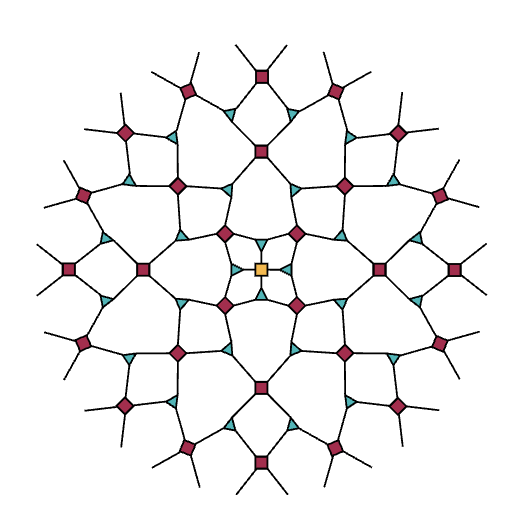

# Tensor Networks: Computational Insights into Quantum Gravity, Information, and Many-Body Systems

This repository explores tensor networks and machine learning optimization techniques as a unified computational framework for studying the deep connections between quantum gravity, quantum information theory, quantum computing, and quantum many-body systems. While holographic tensor networks (particularly in the context of the AdS/CFT correspondence) represent a central focus, this work treats tensor networks more broadly as a powerful lens for understanding entanglement, emergent geometry, renormalization flow, and the computational structure of quantum systems across these interconnected domains.

> **Note**: This repository is under active development as part of my Master's research at the University of Texas at Austin. Code, documentation, and research directions are continuously evolving. Contributions, questions, and collaborations are welcome.

**Research Outline**: See [research_overview.pdf](./research_overview.pdf) for a detailed overview of research directions, questions, and planned work.

This repository houses implementations, algorithms, references, and documentation organized around the following areas:

- [Tensor Networks: Examples and Geometry](./src/tensor_networks/)
  - Physical geometry: [MPS](./src/tensor_networks/mps/), [PEPS](./src/tensor_networks/peps/)
  - Holographic geometry: [MERA](./src/tensor_networks/mera/), [Hyper-invariant](./src/tensor_networks/hyperinvariant/)
- [Quantum Algorithms](./src/quantum_algorithms/)
  - Example circuits (e.g., Deutsch–Jozsa) and their tensor network interpretation
- [Quantum Machine Learning](./src/quantum_machine_learning/)
  - Hybrid quantum-classical: [QCNNs, VQE, QAOA](./src/quantum_machine_learning/hybrid/)
  - Purely quantum: [Quantum kernel methods, QSVMs](./src/quantum_machine_learning/purely_quantum/)
- [Loop Quantum Gravity](./src/loop_quantum_gravity/)
  - [Spin Networks](./src/loop_quantum_gravity/spin_networks/) and [Spin Foams](./src/loop_quantum_gravity/spin_foams/)
  - Tensor network interpretations of LQG structures
- [Research](./src/research/)
  - Novel toy model computation/optimization and experiments
- [References](./references/)
  - Curated papers on tensor networks, holography, and related topics
- [Documentation](./docs/)
  - [Questions, struggles, failures](./docs/questions.md) - Open questions and dead ends
  - [Geometric Deep Learning](./docs/geometric_deep_learning/) - Connections to GDL
<!-- - Reproduction of interesting results from literature -->

I can be reached for questions or comments at:

{ johngrahamreynolds [at] utexas [dot] edu } OR { johngrahamreynolds [at] gmail [dot] com }


<p align="center">
  
  &nbsp;&nbsp;&nbsp;&nbsp;&nbsp;&nbsp;&nbsp;&nbsp;&nbsp;&nbsp;&nbsp;&nbsp;&nbsp;&nbsp;&nbsp;&nbsp;&nbsp;&nbsp;&nbsp;&nbsp;&nbsp;&nbsp;&nbsp;&nbsp;&nbsp;
  <br>
  <sub>Circle Limit IV (1960), M.C. Escher</sub>
  &nbsp;&nbsp;&nbsp;&nbsp;&nbsp;&nbsp;&nbsp;&nbsp;&nbsp;&nbsp;&nbsp;&nbsp;&nbsp;&nbsp;&nbsp;&nbsp;&nbsp;&nbsp;&nbsp;&nbsp;&nbsp;&nbsp;&nbsp;&nbsp;&nbsp;&nbsp;&nbsp;&nbsp;&nbsp;&nbsp;&nbsp;&nbsp;&nbsp;&nbsp;&nbsp;&nbsp;&nbsp;&nbsp;&nbsp;&nbsp;&nbsp;&nbsp;
  <sub>MERA Lattice on a Circle (2015), B. Czech, et al.</sub>
</p>

## Abstract

Tensor networks provide a powerful computational framework for studying quantum systems across multiple domains. This project explores how tensor network methods, combined with machine learning optimization techniques, can reveal novel insights into the connections between quantum gravity (holographic dualities, loop quantum gravity), quantum information theory (entanglement, error correction), quantum computing (circuit algorithms, variational methods), and quantum many-body systems (wavefunction representations, renormalization). By treating quantum circuits as tensor networks and leveraging variational optimization, we aim to develop computational tools that bridge these traditionally separate fields and uncover fundamental structural relationships.

## Research Themes

This project is organized around several interconnected themes:

1. **Tensor Networks as a Unifying Computational Language**: Quantum circuits, many-body wavefunctions, and holographic geometries all admit natural tensor network representations, enabling unified computational approaches.

2. **Machine Learning and Optimization**: Variational tensor network methods, quantum machine learning algorithms, and geometric deep learning connections provide powerful optimization frameworks for exploring quantum systems.

3. **Emergent Geometry from Entanglement**: Understanding how geometric structure (from AdS space to spin network geometry) emerges from entanglement and information-theoretic principles.

4. **Cross-Domain Connections**: Using computational methods to uncover and validate connections between quantum gravity, quantum information, quantum computing, and many-body physics.

## Setup

### Environment Setup (using Conda)

**Initial setup (one-time):**
```bash
# Create the conda environment
conda env create -f environment.yml

# Activate the environment
conda activate holo_tns

# Install all requirements with exact pinned versions
pip install -r requirements.txt

# Install the package in editable mode (enables clean imports)
pip install -e .
```

After running `pip install -e .`, you can import from `src/` modules without path hacks:
```python
# Clean imports (no sys.path manipulation needed)
from utils import PAULI_X, build_operator_at_site
from tensor_networks.mps import MPS
```

**Development workflow:**

As you install new packages:

```bash
# 1. Install the new package
pip install new_package_name

# 2. If it's a main dependency, add it to pyproject.toml
#    Edit the 'dependencies' list in pyproject.toml

# 3. Update requirements.txt with exact versions
pip freeze > requirements.txt
```

This workflow maintains two complementary files:
- **`pyproject.toml`**: Defines main dependencies (used for package definition)
- **`requirements.txt`**: Captures all packages with exact versions (ensures reproducibility)

**Notes:**
- The project uses Python 3.11 for compatibility with modern machine learning and tensor network libraries
- GPU support can be added by installing appropriate packages for your hardware (CuPy, JAX, Apex, etc.)
- Run `pip install -e .` again if you recreate the conda environment

### Jupyter Notebooks

The project includes example notebooks (e.g., `src/tensor_networks/mps/ising_open_bc_example.ipynb`) that demonstrate tensor network training and experimentation.

**For serverless environments (Google Colab, Databricks, etc.):**
- Clone the repository and install the package in editable mode
- See individual example notebooks for setup instructions
- Use `serverless_development.ipynb` at the project root for active development with GPU/TPU access

**For local Jupyter kernels:**
- Examples work out of the box with the `holo_tns` conda environment
- The package is already installed via `pip install -e .`
- No additional setup required

More example notebooks will be added gradually as the project develops.

## Overview

This project uses tensor networks and machine learning optimization techniques to explore fundamental connections across quantum physics. A central unifying theme is that tensor networks provide a computational language that bridges:

- **Quantum Gravity**: Holographic tensor networks (MERA, hyper-invariant) as realizations of gauge/gravity duality (AdS/CFT), spin networks and spin foams in loop quantum gravity
- **Quantum Information**: Entanglement structure, quantum error correction, and information-theoretic perspectives on geometry
- **Quantum Computing**: Quantum circuits as tensor networks, connecting algorithmic constructions to many-body methods
- **Quantum Many-Body Systems**: Efficient wavefunction representations, variational methods, and renormalization group flow

By viewing quantum circuits, many-body states, and gravitational dualities through the same tensor network lens, we aim to uncover novel computational insights and optimization strategies that reveal deep structural connections between these seemingly disparate domains.

### Repository Structure

- **Tensor Networks**: Implementations and geometry (`src/tensor_networks/`)
- **Quantum Algorithms**: Canonical algorithms with tensor network interpretations (`src/quantum_algorithms/`)
- **Quantum Machine Learning**: Hybrid and purely quantum learning methods (`src/quantum_machine_learning/`)
- **Loop Quantum Gravity**: Spin networks and spin foams (`src/loop_quantum_gravity/`)
- **Background Literature**: Curated papers and references (`references/`)
- **Documentation**: Research questions, notes, and explorations (`docs/`)

## Experiments

## Appendices
