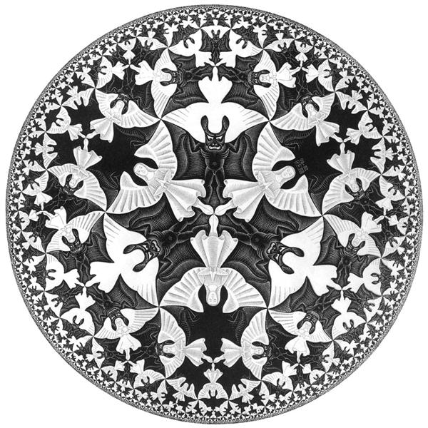

# Computational Holography: Tensor Networks, RG Flow, and Emergent Geometry

This repo is home to my broad study of holographic tensor networks. Particularly, I am interested in tensor networks as an effective, phenomenological realization of the gauge/gravity duality conjecture in theoretical physics. The most famous example of this conjecture is the AdS/CFT correspondence, which I target as an initial starting point for novel computational study. 


The aim of this robust repo is to house all resources integral to the full scientific research process. Use the navigation below to explore implementations, algorithms, references, and tooling:

- [Tensor Networks: Examples and Geometry](./tensor_networks/)
  - Physical geometry: [MPS](./tensor_networks/mps/), [PEPS](./tensor_networks/peps/)
  - Holographic geometry: [MERA](./tensor_networks/mera/), [Hyper-invariant](./tensor_networks/hyperinvariant/)
- [Quantum Algorithms](./quantum_algorithms/)
  - Example circuits (e.g., Deutsch–Jozsa) and their tensor network interpretation
- [Research](./research/)
  - Novel toy model computation/optimization and experiments
- [References](./references/)
  - Curated papers on tensor networks, holography, and related topics
- [Frameworks](./frameworks/)
  - Reusable ML/tensor-network utilities and internal tooling
- [Questions, struggles, failures](./questions.md)
  - Notes that capture open questions and dead ends (useful for future work)
<!-- - Reproduction of interesting results from literature -->

I can be reached for questions or comments at:

{ johngrahamreynolds [at] utexas [dot] edu } OR { johngrahamreynolds [at] gmail [dot] com }


<div align="center">
  
  <br>
  <em>Circle Limit IV (1960), M.C. Escher</em>
</div>

## Abstract

## Setup

### Environment Setup (using Conda)

**Initial setup:**
```bash
# Create the conda environment
conda env create -f environment.yml

# Activate the environment
conda activate holo_tns

# Install all requirements with exact versions
pip install -r requirements.txt
```

**Development workflow:**

As you add packages with `pip install`, update `requirements.txt` to maintain reproducibility:

```bash
# After installing new packages, export exact versions
pip freeze > requirements.txt
```

This captures all installed packages (including transitive dependencies) with exact versions, ensuring full reproducibility for research purposes.

The project uses Python 3.11 for compatibility with modern tensor network libraries. GPU support can be added later by installing appropriate packages for your hardware (CuPy, JAX, Apex, etc.).

## Overview
This project studies tensor networks as computational models of quantum systems and as phenomenological realizations of holographic dualities. A central theme is viewing quantum circuits themselves as tensor networks, unifying algorithmic constructions with many-body methods and geometric interpretations.

See:
- Implementations and geometry: `tensor_networks/`
- Algorithmic examples: `quantum_algorithms/`
- Background literature: `references/`

## Experiments

## Appendices
