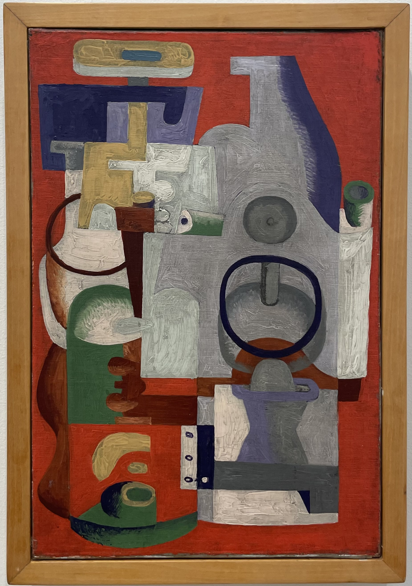
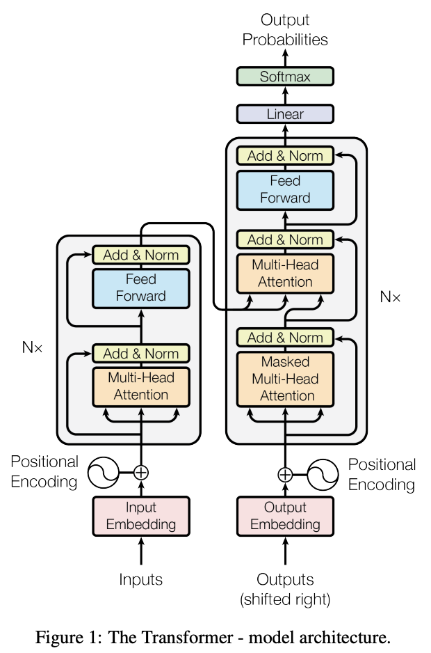

# Geometric Deep Learning

Recent work in the mathematical foundations of machine learning has attempted classify many common deep learning architectures according to their underlying network geometry. This field, known as *geometric deep learning*, may prove fruitful to the study of emergent holographic geometry in tensor networks.  

  

    
    
Abstract Composition (1927), Le Corbusier (Charles-Édouard Jeanneret)

  

  

    
    
Transformer Architecture (2017), Vaswani, et al.

  

## Non-Euclidean Optimization

Traditional machine learning methods typically perform (ideally convex) optimization to find extrema in high-dimensional, *Euclidean* latent spaces learned from labeled datasets. Neural networks are designed to efficiently discover features within this Euclidean framework. A key insight of geometric deep learning is extending optimization to more general, non-Euclidean manifolds—typically *Riemannian* or *pseudo-Riemannian*—with nontrivial metrics. By transforming the data space into these curved geometric spaces, hidden features and intrinsic characteristics of the dataset can be more naturally and effectively uncovered.

