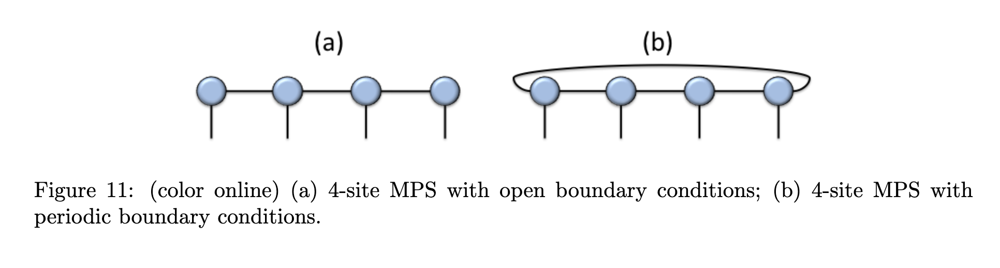

# Matrix Product States (MPS)

## Overview

Matrix Product States (MPS) are a type of tensor network capable of efficiently (in some cases, exactly) representing a one-dimensional quantum many-body problem. A diagrammatic view is given below, with the common convention taken that each node in the network represents a tensor with *k* indices, where *k* is the number of edges extending from the node. Connected edges between tensors are contractions.

A great primer on Matrix Product States (MPS), and tensor networks in general, can be found in [Orús_intro](../../references/Orus_TensorNetworksIntro.pdf).

  
   
  Finite MPS diagram, taken from the Orús paper referenced above

## Example

In this example, we use PyTorch to optimally learn the tensor values in the MPS representation of a 1D quantum many-body system.

See also:
- Parent overview: `../`
- Code: `mps.py` and `1d_systems/`
- Background literature: `../../references/`